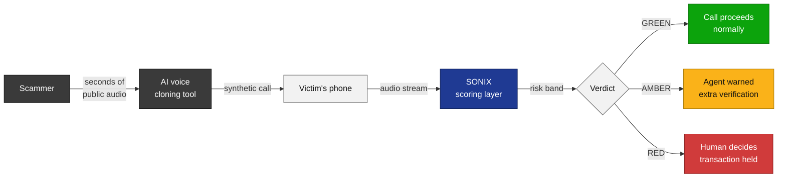
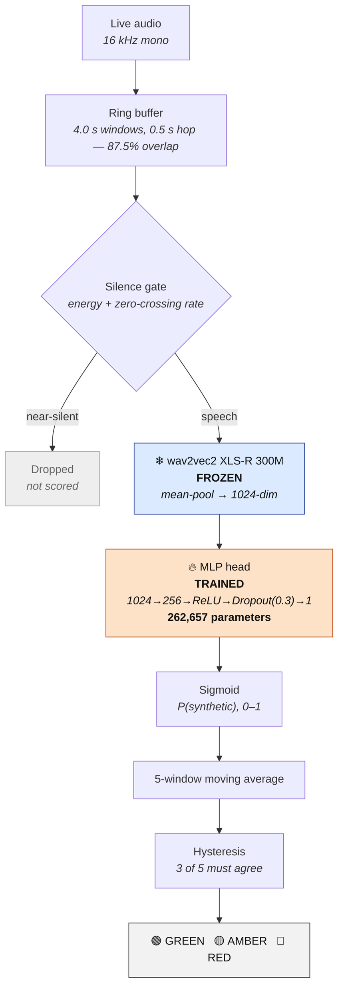
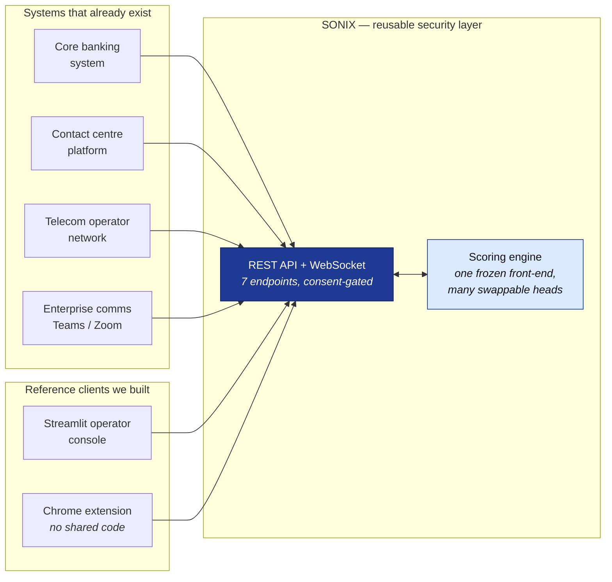
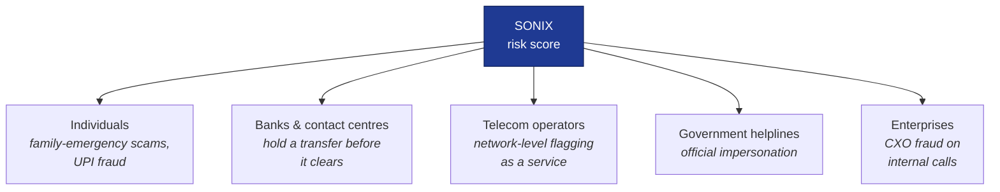
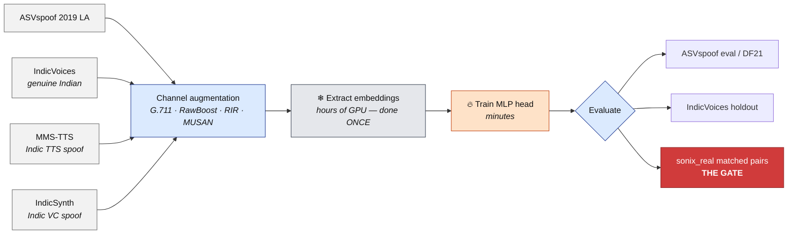

# SONIX — Master Project Document

**SIH 2026 · Problem Statement SIH26104 · AICTE Cyber Security Cell · Team SONIX**
Real-time AI voice-clone detection for live calls.

**This is the single source of truth for the project.** It supersedes
`PPT_MASTER.md`, `YUKTI_PPT_REFERENCE.md`, `PPT_STATUS.md` and `DEPLOYMENT_MODEL.md`.
Everything a teammate — or a teammate's AI — needs to write a script, build the
deck, draw a flowchart, or answer a judge is in here.

Branch: `yugal/ml-pipeline` · Last updated **3 September 2026**

---

## 0. How to use this file

Paste the whole thing into your AI session as context, then ask for what you need
("build slide 4", "write the demo script", "render the pipeline flowchart").

**Four rules that override everything else:**

1. **Never invent a number.** §6 is the ledger. If a figure is not marked 🔒 there,
   it does not go on a slide, in a script, or in an answer. Use `[[PLACEHOLDER]]`.
   A blank cell is survivable. A wrong number in front of a jury is not.
2. **The metric is EER, not accuracy.** Our data is ~73–90 % spoof. "Fake every
   time" scores 90 % accuracy and is worthless.
3. **Higher score = the model thinks it is FAKE.** Scores run 0–1. State this
   wherever a score appears.
4. **SONIX is a security layer with an API, not an app.** §7. Most teams miss this;
   the problem statement says it three times.

---

## 1. The project in one paragraph

AI voice cloning is cheap and convincing from seconds of audio. Attackers
impersonate CXOs, bank officials and family members to authorise transfers,
extract OTPs, and bypass voice verification. India is a large target: UPI fraud,
family-emergency scams, official impersonation. **Telephony has no way to tell a
cloned voice from a real one while the call is happening.** SONIX scores a live
call for the probability that the voice is synthetic and surfaces it as
Green / Amber / Red. It never blocks a call — it flags for a human.

---

## 2. What the problem statement demands

Direct quotes, because they drive design decisions we must defend:

> *"expose **APIs and SDKs** for seamless integration with banking applications,
> enterprise communication systems, and telecom operator infrastructures"*

> *"**REST/gRPC APIs and SDKs** for integration with core banking systems, contact
> center platforms, enterprise communication tools, and telecom networks"*

> *"A **reusable security layer** for telecom operators and enterprises"*

> *"diverse Indian accents and dialects"*

The last one is why the Indic work exists. The first three are why §7 exists.

---

## 3. Architecture

### 3.1 The pipeline — be exact; vagueness costs 20 % of the score

```
live audio (16 kHz mono)
  → 4.0 s windows at 0.5 s hop            87.5 % overlap
  → silence gate (VAD)                    near-silent windows dropped
  → wav2vec2 XLS-R 300M, FROZEN ❄         → mean-pool → 1024-dim vector
  → MLP head, TRAINED 🔥                   1024 → 256 → ReLU → Dropout(0.3) → 1
                                           262,657 parameters
  → sigmoid                                → P(synthetic), 0–1
  → 5-window moving average
  → hysteresis: 3 of 5 must agree to switch band
  → 🟢 GREEN / 🟡 AMBER / 🔴 RED
```

### 3.2 Why this shape

**Frozen front-end, tiny trainable head.** 300M frozen parameters listen;
262,657 trained parameters decide. When a new cloning tool appears: extract
embeddings once, retrain the head in **minutes**, serve it from `/api/models`.
No redeployment, no downtime, no second GPU — every head shares the one
resident front-end.

**Embeddings are the expensive, reusable artifact.** Extracting them is hours of
GPU time. Training a head on them is minutes. This is why the team's work
divides the way it does: teammates produce embeddings, one machine trains heads.

**Streaming, not batch.** Overlapping windows, a silence gate, temporal
smoothing and hysteresis. This is the machinery that makes a detector
deployable rather than a notebook result.

### 3.3 Thresholds and band logic

| Setting | Value | Note |
|---|---|---|
| Amber | 0.10 | data-driven from the eval score distribution |
| Red | 0.90 | same |
| Smoothing | 5-window moving average | one odd window cannot flip the verdict |
| Hysteresis | 3 of 5 must agree to switch | prevents band flicker |

Both thresholds are operator-configurable. A bank would set them stricter for
fund transfers than for general enquiries — say that out loud in the demo.

---

## 4. Repository map

```
realtime/            THE LIVE SYSTEM — this is the product
  server.py            aiohttp: 7 REST endpoints + WebSocket + /mic capture page
  engine.py            scoring loop: batches windows across calls, one front-end
  session.py           per-call state machine, consent gate, VAD, audit trail
  models.py            model registry — which heads exist and where
  frontend.py          frozen wav2vec2 XLS-R 300M, loaded once, cache-first
  ringbuffer.py        4.0 s windows at 0.5 s hop
  vad.py               silence gate (energy + zero-crossing rate)
  live_ui.py           Streamlit operator console (a CLIENT of the API)
  miccapture.py        browser microphone capture panel
  source.py            audio adapters: file (pull) and mic (push)

demo/                OFFLINE DEMO UI — three model tabs, replay mode
src/                 TRAINING AND EVALUATION
  extract_embeddings.py  audio → 1024-dim vectors (the expensive step)
  train.py               train an MLP head; --extra-emb-root stacks corpora
  eval.py, metrics.py    EER, thresholds, score arrays
  calibration.py         temperature scaling
extension/           Chrome extension — a SECOND, independent API client
sonix_sdk.py         Python SDK: SonixClient, score_file, band, risk
sonix_real/          LABELLED TEST SET — real vs cloned Indian public figures
outputs/models/      trained heads (~1 MB each, committed to git on purpose)
docs/                this file, API.md, RESULTS_TABLE.md, handbooks
```

**Root-level data tools:** `augment_folder.py` (channel augmentation, folder in /
folder out), `make_indic_spoof.py` (MMS-TTS generation), `prep_indicsynth.py`,
`prep_asvspoof5.py`, `prep_mlaad.py`, `stamp_labels.py`, `split_indic_holdout.py`,
`bench_clips.py`, `verify_head.py`, `inspect_ckpt.py`, `flag_rate.py`.

---

## 5. Data

### 5.1 Training corpora — what the current head actually saw

| Root | Bonafide | Spoof |
|---|---|---|
| `embeddings` (ASVspoof 2019 LA, clean) | 2,580 | 22,800 |
| `embeddings_g711` (G.711 μ-law codec copies) | 2,580 | 22,800 |
| `embeddings_rawboost` (RawBoost channel/impulsive) | 2,580 | 22,800 |
| `embeddings_rirmusan_bonafide` (room reverb + MUSAN noise) | 2,580 | 0 |
| `embeddings_rirmusan_spoof` | 0 | 22,800 |
| `embeddings_indicvoices_tr` (genuine Indian speech) | 37,032 | 0 |
| `embeddings_mms_tts` + `_aug` (Indic TTS spoof) | 0 | 1,600 |
| `embeddings_indicsynth` + `_aug` (Indic VC spoof) | 0 | 33,600 |
| **TOTAL** | **47,352** | **126,400** |

**The Indic slice: 37,032 real vs 35,200 fake — a 1.05 : 1 ratio.**
Before this work it was 37,032 real vs **zero** fake. That ratio *was* the bug (§8, Case 3).

### 5.2 Indic spoof corpus — 35,200 embeddings, 3 synthesis families, 12 languages

| Family | Rows | Languages |
|---|---|---|
| MMS-TTS (text-to-speech) | 1,600 (800 clean + 800 augmented) | Hindi, Marathi, Bengali, Tamil, Telugu |
| IndicSynth (voice conversion) | 33,600 (16,800 + 16,800 augmented) | 12 Indian languages |

Full language list: Hindi, Bengali, Tamil, Telugu, Marathi, Gujarati, Kannada,
Malayalam, Odia, Punjabi, Sanskrit, Urdu.

**Channel augmentation** applied to half of each family: G.711 μ-law round-trip,
synthetic RIR convolution reverb, pink noise at a target SNR (8–30 dB).
Defaults: p-reverb 0.8, p-noise 0.8, p-codec 0.5.

### 5.3 Held-out test sets — NEVER train on these

- ASVspoof 2019 LA **eval** (71,237: 7,355 bonafide / 63,882 spoof)
- ASVspoof 2019 LA **dev** (24,844: 2,548 / 22,296)
- ASVspoof 2021 **DF** (75 % CM-key coverage — always state this)
- **In-the-Wild** (real internet deepfakes, unseen tools)
- **IndicVoices holdout** — 12 % of recordings, split by *recording id* not row id,
  so `<id>_chunk_N` siblings cannot leak across the split
- **`sonix_real/`** — see below

### 5.4 `sonix_real/` — the set that decides everything

Real and cloned recordings of the same Indian public figures. This is the only
test that answers the question the whole Indic effort exists for: *can we tell a
cloned Indian voice from the real one?*

- **9 named genuine** recordings: Modi, Rahul Gandhi, SRK, Bhuvan Bam,
  Ashish Chanchlani, Manmohan Singh, Nizamuddin, Rajat Sood, TVK Vijay
- **10 named clones** of the same speakers, plus Sonam
- Plus `real_01…10` and `fake_01…10`

**A matched real/clone pair from the same speaker is the single most persuasive
thing in the demo.** Nothing else lands the way that does.

### 5.5 Dataset status by owner

| Source | Owner | Status |
|---|---|---|
| ASVspoof 2019 LA + G.711 + RawBoost | Yugal | ✅ |
| MMS-TTS Indic spoof + augmented | Yugal | ✅ 1,600 rows, verified |
| IndicSynth Indic spoof + augmented | Akshat | ✅ 33,600 rows, verified |
| RIR/MUSAN augmented | Navya | ✅ |
| IndicVoices (genuine Indian speech) | Navya | ✅ |
| ASVspoof 5 | Navya | ✅ (in `head_full_indic_as5`) |
| `sonix_real/` labelled clips | Anubhav | ✅ in repo |
| In-the-Wild | Akshat | ⏳ not extracted |
| MLAAD | Navya | ⛔ gated — needs manual author approval, not just terms acceptance |

---

## 6. The numbers ledger

### 🔒 LOCKED — safe to present

| Fact | Value |
|---|---|
| Architecture | frozen wav2vec2 XLS-R 300M + **262,657-param** MLP head |
| Windowing | 4.0 s window, 0.5 s hop, 87.5 % overlap |
| Band logic | 5-window moving average, hysteresis 3-of-5 |
| Thresholds | Amber 0.10, Red 0.90, operator-configurable |
| API surface | 7 REST endpoints + WebSocket, 2 independent clients |
| Padding bug, 1 s | 0.8795 → **0.0329** |
| Padding bug, 2 s | 0.5061 → **0.0005** |
| Padding bug, 3 s | 0.2224 → **0.0096** |
| Padding bug, full 66 s (control) | 0.1171 → 0.1171, unchanged |
| SNR shortcut — genuine clips that passed | 34.6, 37.7 dB → median 0.011, 0.002 |
| SNR shortcut — genuine clips that failed | 39.2–66.8 dB → median 0.779–1.000 |
| SNR shortcut — synthetic clips | 96–140 dB |
| Indic spoof corpus built | **35,200 embeddings**, 3 families, 12 languages |
| Training corpus total | 47,352 bonafide / 126,400 spoof |
| Calibration temperature | T ≈ 1.05 |
| Calibration effect on EER | **none** — identical before and after |

**Historical, and now contested:** ASVspoof-2019 LA eval EER **1.4937 %** @ threshold
0.095130 for the baseline `head.pt`, eval set 71,237. Reproduced independently by
two implementations to four decimals on 1 Sept. **But `head.pt` was later
overwritten during a merge**, so this figure must be re-established with
`verify_head.py` before it is quoted again. Treat as ⏳ until that passes.

### ⏳ PENDING — placeholders only, with an owner

| Token | Owner | Blocked on |
|---|---|---|
| `[[EER_INDOMAIN]]` | Yugal | `verify_head.py` on the current checkpoints |
| `[[EER_DF21]]` | Navya | final model — must carry **"(75 % key coverage)"** |
| `[[FA_REAL]]` | Yugal | final model + `sonix_real/` |
| `[[FA_INDIC]]` | Navya | final model. Per 4-second chunk, **not** per call |
| `[[INDIC_CLONE_DETECT]]` | Yugal | the `sonix_real/` pair test — now unblocked |
| `head_v3` real EER | Yugal | dev EER 0.24 % is a sanity check, never a headline |
| `head_full_indic_as5` anything | Navya | **nothing verified on our machine** |

### ⛔ BLOCKED — design the slide to survive without

| Token | Why | Plan B |
|---|---|---|
| `[[EER_ITW]]` | In-the-Wild not extracted | "⏳ measurement in progress" row |
| Cost / scale figures | Nobody assigned | 30 minutes of work; winners cite this as a differentiator |
| Latency | Never measured | Do not quote a number |

### ⚠️ The claim that must not appear

We measured **57 % of genuine Indian speech flagged as fake**, then trained a
model that cut it to **0.02 %**. Both numbers are real. **But that model also
passes cloned Indian voices as genuine** — every Indian sample it ever saw was
real, so it learned *"Indian audio = real"* rather than learning to detect.

- ✅ *"We discovered our detector fails on Indian speech, measured it, diagnosed
  the cause, and built a 35,200-clip Indian synthetic-speech corpus across three
  generator families to fix it."*
- ❌ *"We fixed it — 57 % → 0.02 %."*

If the `sonix_real/` pair test verifies before submission, this moves to 🔒.
Until then it does not.

### ❌ Never say

"99 % accurate" · "detects any AI voice" · any latency figure · "we have a
production API" (say **"a working service interface"**) · any number not 🔒 above.

---

## 7. Deployment — an API and SDK, not an application

**This is the section most teams will miss.**

SONIX is **middleware**. Banks, contact centres and telcos call it from inside
systems they already run. The dashboard is a *client*, not the product.

| Layer | What it is | How to present it |
|---|---|---|
| Scoring engine | Frozen front-end + trained heads, batched across concurrent calls | The core IP |
| **Integration API** | 7 REST endpoints + WebSocket, consent-gated | **The deliverable** |
| Operator console | Streamlit dashboard, live risk timeline | A reference client |
| Chrome extension | Browser-call capture | A second client — proves platform-agnosticism |

### The endpoints

| Method | Path | Purpose |
|---|---|---|
| `GET` | `/api/status` | health, mode, active calls, engine stats |
| `GET` | `/api/models` | which heads are loaded, and their descriptions |
| `POST` | `/api/score-file` | submit audio; returns immediately, streams results |
| `GET` | `/api/telemetry?call_id=` | per-window scores, VAD decisions, ring-buffer stats |
| `POST` | `/api/approve` | approve the pairing/consent code |
| `POST` | `/api/end-call` | finalise and archive the call |
| `WS` | `/ws` | live score stream + browser mic audio in |
| `GET` | `/mic` | browser microphone capture page |

### The slide that proves we read the PS

```python
from sonix_sdk import SonixClient
sonix = SonixClient("http://sonix.internal:8000")

result = sonix.score_file("call_88213.wav")
if result.band == "RED":
    hold_transaction(reason=f"voice-clone risk {result.mean:.0%}")
```

**Put this on slide 3.** A judge who reads it believes the integration story instantly.

### The strongest honest claim

**Two independent clients already consume the same endpoints** — a Python
dashboard and a JavaScript Chrome extension, sharing no code. That is the real
test of whether something is an interface or just an app's backend, and most
hackathon "APIs" fail it.

### Maturity — state it yourself before a judge does

We have a working service interface: 7 REST endpoints, WebSocket streaming,
proper status codes, two independent clients. **What it is not yet:**
authenticated, versioned, or a published SDK. Those are days of work, not
architecture changes — the separation that makes them cheap already exists.
Drawing that line yourself earns more credibility than claiming a finished API.

---

## 8. The story spine — we find our own failures and fix the cause

This is what makes a practitioner jury believe everything else. Anyone can show
a good number. Almost nobody shows a measured before-and-after of a bug they
found themselves. **Frame all four as: observation → hypothesis → measurement →
root-cause fix → verification.**

### Case 1 — the padding bug

The model listens in 4-second chunks. Shorter clips were padded with *digital
silence*, so a 1-second clip was three-quarters nothing — and the model called
real people fake. We now repeat the audio instead of padding it.

| Clip length | Before (zero-pad) | After (repeat-pad) |
|---|---|---|
| 1 second | **0.8795** | **0.0329** |
| 2 seconds | 0.5061 | 0.0005 |
| 3 seconds | 0.2224 | 0.0096 |
| Full 66 s (control) | 0.1171 | 0.1171 — unchanged |

### Case 2 — the background shortcut

Genuine recordings still flagged. Instead of tuning thresholds we investigated:
the model had learned **"clean background = fake"**, not synthesis detection.
ASVspoof's silence is digitally dead at −75 dBFS, a floor no real microphone
produces. Phone noise-suppression strips room tone, so genuine voices looked
synthetic.

| | SNR | Median score |
|---|---|---|
| Passing genuine clips | 34.6, 37.7 dB | 0.011, 0.002 |
| Failing genuine clips | 39.2–66.8 dB | 0.779–1.000 |
| Synthetic clips | 96–140 dB | — |

**Fixed in the training data**, not the thresholds: room reverb and real-world
noise, so background can no longer be a cue.

### Case 3 — the Indian-speech blind spot, and the second shortcut underneath it

The PS demands *"diverse Indian accents and dialects"*, so we tested it. **The
majority of genuine Indian speech was flagged as fake.** We added IndicVoices to
training and the false-alarm rate collapsed to 0.02 %.

Then we tested a matched pair — a real and a cloned recording of the same
speaker — and found the fix had created a *second* shortcut:

| Model | Real Indian voice | Cloned Indian voice | What it actually learned |
|---|---|---|---|
| `head_robust_v2` | ✗ fake | ✓ fake | "Indian audio = fake" |
| `head_full_ho` | ✓ real | ✗ real | "Indian audio = real" |

The cause, verified in the extraction script: **IndicVoices is bonafide-only.**
`grep -c spoof scripts/extract_indicvoices.py` returns 0 — one label constant,
`BONAFIDE_LABEL = 0`. The only association available to the model was
"Indian phonetics → genuine". The 0.02 % figure is an honest false-alarm
measurement and says **nothing whatsoever** about detection.

**The fix:** build Indian synthetic speech so the language appears on both sides
of the label. 35,200 spoof embeddings across three synthesis families brought
the Indic slice from 37,032 : 0 to 37,032 : 35,200 — a 1.05 : 1 ratio.

**Verification is the open item.** The `sonix_real/` pair test is the gate.

### Case 4 — the engine bugs (use only if asked about engineering rigour)

Two production-shaped defects found and fixed during integration:

- A `NameError` in the head forward pass killed the scoring task on the first
  batch. The server kept accepting audio and scored nothing, silently, because
  asyncio swallowed the exception. Fixed, plus a done-callback that shouts, plus
  per-batch isolation so one failure cannot end scoring for the process.
- `_trim_pending()` subtracted an int from `None` — uploads deliberately have no
  backlog cap — killing the audio feed on the *first* window of every upload. A
  62-window clip returned one score, filed under index `−1`, and the dashboard
  drew a confident GREEN band from it. **Every upload verdict collected before
  this fix is void.**

The lesson worth stating: *a detector that fails loudly is safer than one that
fails silently, and we now instrument for that.*

---

## 9. The models

Seven heads are registered and present. All share the one frozen front-end.

| Key | File | Trained on | Verified? |
|---|---|---|---|
| `baseline` | `head.pt` | ASVspoof 2019 LA clean | 1.4937 % eval EER — **needs re-verification after a merge overwrite** |
| `augmented` | `head_aug.pt` | + G.711 μ-law | dev 0.24 % (not comparable to baseline — different test set) |
| `robust` | `head_robust.pt` | + RawBoost | — |
| `robust_v2` | `head_robust_v2.pt` | + RIR/MUSAN | learned "Indian audio = fake" |
| `full_ho` | `head_full_ho.pt` | + IndicVoices, holdout-safe | learned "Indian audio = real"; DF21 5.27 % vs baseline 9.48 % |
| `full_indic_as5` | `head_full_indic_as5.pt` | + IndicVoices + ASVspoof 5 (Navya) | **nothing verified on our machine** |
| `v3` ← **default** | `head_v3.pt` | everything + 35,200 Indic spoofs | dev EER 0.24 % @ epoch 31 — sanity check only |

**Why `v3` is the default:** it is the only head with Indian languages on *both*
sides of the label. That is a reasoning-based choice, **not** a verified
head-to-head. `head_full_ho`'s 0.02 % Indian false-alarm rate looks better and
measures nothing (§8, Case 3). The `sonix_real/` pair test decides the real winner.

**Why dev EER is never a headline:** dev shares attack types with training, so a
near-zero figure there is expected, not evidence of quality.

**Sanity rules for any EER you compute:** single digits = working · ~40 % = label
bug · ~0 % = data leak. Class imbalance is handled with `pos_weight = n_neg/n_pos`.

---

## 10. Running the system

All commands from the repo root, using the venv's python directly (activation is
unreliable on this machine):

```bat
cd /d C:\Users\yugal\OneDrive\Desktop\Sonix

REM Live server — 7 endpoints + WebSocket, all heads loaded
.venv\Scripts\python.exe -m realtime.server --mode upload --auto-approve

REM Operator dashboard (second terminal)
.venv\Scripts\python.exe -m streamlit run realtime\live_ui.py

REM Offline demo UI with model tabs and replay mode
.venv\Scripts\python.exe -m streamlit run demo\app.py
```

Useful flags: `--ws-port 8001` (port clash) · `--vad-energy 0.003` (quiet mic) ·
`--max-batch-size 4` (GPU too small for 8) · `--mock` (no checkpoint needed).

**Before the demo, set `HF_HUB_OFFLINE=1`** so the model load never touches the
network.

**Training a head:**

```bat
.venv\Scripts\python.exe src\train.py ^
  --emb-root outputs\embeddings ^
  --extra-emb-root outputs\embeddings_g711 ^
  --extra-emb-root outputs\embeddings_rawboost ^
  --extra-emb-root outputs\embeddings_indicvoices_tr ^
  --extra-emb-root outputs\embeddings_indicsynth ^
  --out outputs\models\head_v4.pt
```

`--extra-emb-root` uses `action="append"`, so the roots genuinely stack.

**Verification tools:** `verify_head.py` (does a checkpoint still reproduce its
headline EER?) · `bench_clips.py` (score a folder across every head) ·
`flag_rate.py` (false-alarm rate on genuine audio) · `inspect_ckpt.py` (what is
inside a `.pt`).

---

## 11. Team and ownership

| Person | Owns |
|---|---|
| **Yugal** | ML pipeline, training, the live engine, integration, this branch |
| **Navya** | RIR/MUSAN augmentation, IndicVoices, ASVspoof 5, DF21 evaluation |
| **Akshat** | IndicSynth corpus, In-the-Wild, labelled real/clone recordings |
| **Anubhav** | Data extraction, mic-capture panel, `sonix_real/` clip set |
| **Suryansh** | Demo UI, replay mode, the Chrome extension |
| **Yukti** | Metrics, `RESULTS_TABLE.md`, the presentation |

Everyone pulls from and pushes to **`yugal/ml-pipeline`**. All teammate branches
are merged into it as of 3 September.

---

## 12. The gates left before submission

In priority order. The first one is not optional.

1. **🔴 THE GATE — the `sonix_real/` pair test.** Run every head over the matched
   real/clone pairs. This decides whether the entire Indic effort worked, which
   model ships, and whether the Indian-clone claim can be made at all.
   ```bat
   .venv\Scripts\python.exe bench_clips.py --dir sonix_real\sonix_real --all-models
   ```
2. **Re-verify `head.pt`** with `verify_head.py` — the 1.4937 % headline needs to
   survive the merge overwrite before it goes back on a slide.
3. **Score the IndicVoices holdout** with `v3`, then `flag_rate.py`.
4. **Train the four ablations** — A: no Indic spoof · B: MMS-TTS only ·
   C: IndicSynth only · D: no augmented copies. This is what turns "we built a
   corpus" into "we measured what the corpus bought".
5. **Cost and scale** — 30 minutes: GPU cost per call-minute, concurrent calls per
   instance, deployment cost. Unassigned. Winners cite this as a differentiator.
6. **Record the backup demo video.**

---

## 13. Building the PPT

### 13.1 Two audiences, and which one wins

**Audience A — the portal reviewer.** 114 teams narrow to 45; those 45 upload the
deck and SIH picks the top 5 **from the PPT alone**. Nobody in the room. No
narration. No demo.

**Audience B — the live jury.** 4 min slides, 6 min demo, 5 min questions.

**Optimise for A.** It is the round that eliminates you, and a self-contained
slide still works when someone talks over it — the reverse is not true.

**Test every slide: is it understandable with the sound off?** Every chart gets a
caption stating its *conclusion*, not its axes.

### 13.2 What evaluators score

| Weight | Criterion | What it means for us |
|---|---|---|
| **25 %** | Innovation & uniqueness | §13.3 — highest weight |
| 20 % | Problem understanding | Show we understand *Indian* voice fraud specifically |
| 20 % | Technical feasibility | Named components, real numbers, buildable architecture |
| 20 % | Impact & scalability | Who benefits, at what scale, at what cost |
| 15 % | Presentation quality | Necessary, smallest slice — don't spend all night on gradients |

**Rejection patterns:** vagueness about *how* · drifting off the problem statement ·
AI buzzwords with no substance.

**Format rules:** diagrams over text · **max 6 bullets/slide** · **min 14 pt font**.

> ⚠️ Confirm the official SIH template from the portal. Slide counts vary by year.
> This document gives content and visuals; map them onto whatever skeleton is official.

### 13.3 Innovation — the 25 % slice

Do **not** present "we trained a deepfake detector". Every team presents that.
Four real differentiators:

**① Streaming, not batch.** Nearly every published detector classifies a whole
file offline. We run on a live stream with overlapping windows, a silence gate,
temporal smoothing and hysteresis.

**② Frozen front-end, tiny trainable head.** 300M frozen listen, 262,657 trained
decide. New cloning tool → retrain in minutes. `/api/models` serves several heads
behind one endpoint with no extra GPU memory.

**③ Consent and audit designed in from day one.** Pairing-code consent gate,
immutable per-call audit trail, no audio retention. **Enforced in the state
machine** — `push_audio()` drops frames unless the call is approved. Most
projects ignore this entirely.

**④ We audit our own model and fix root causes.** The rarest one — §8.

### 13.4 Slide-by-slide visual specification

**Slide 1 — Title.** Official SIH fields only: PS ID **SIH26104**, theme, category
(Software), Team ID, Team Name. No visual.

**Slide 2 — Idea / Solution.** Primary visual: the attack-and-defence flow
(flowchart A in §14), horizontal, five steps. Real icons, not ASCII.
**Colour the band Green/Amber/Red — it is our product identity; use it on at
least three slides.** Max 6 bullets: real-time not post-call · flags never blocks ·
consent-gated · thresholds configurable per organisation.

**Slide 3 — Technical Approach.** Two visuals side by side:
- **The pipeline** (flowchart B) — each stage boxed with its data shape.
  **Snowflake ❄ on the frozen front-end, flame 🔥 on the trained head.** This
  makes the architecture argument in one glance.
- **The integration diagram** (flowchart C) — our API in the middle, arrows out to
  core banking / contact centre / telecom / collaboration platforms. **This is the
  slide that proves we read the PS.**

Plus the three-line SDK snippet from §7. Stack in small type: Python, PyTorch,
transformers, Streamlit, aiohttp WebSockets, Chrome extension.

**Slide 4 — Feasibility & Viability.** Our strongest slide. Two charts:
- **Chart A — the padding fix.** Line chart, X = clip length, Y = fake-score 0–1,
  two lines (before/after), dashed horizontal line at 0.10 labelled "Amber
  threshold". Y-axis in plain words: *"model's fake score (higher = thinks it's
  fake)"*. Caption: *"A 1-second clip of a real human went from confidently fake
  to confidently real."*
- **Chart B — the shortcut.** Scatter, X = SNR dB, Y = median score, genuine vs
  synthetic in two colours, vertical line at ~38 dB. Caption: *"The model had
  learned 'clean background = fake', not synthesis detection. We found it, proved
  it, fixed it in the training data."*

Then the benchmark matrix from §13.5 and a short risk/mitigation list.

**Slide 5 — Impact & Benefits.** Primary visual: stakeholder map (flowchart E) —
individuals, banks and call centres, telecom operators, government helplines,
with the benefit named for each. Give privacy real space: consent gate, audit
trail, no retention, feature-only logging. Avoid unattributed statistics.

**Slide 6 — Research & References.** Two columns. **Datasets:** ASVspoof 2019 LA,
ASVspoof 2021 DF, ASVspoof 5, In-the-Wild, IndicVoices, IndicSynth, MLAAD.
**Papers:** Müller et al. INTERSPEECH 2022; wav2vec2 / XLS-R; RawBoost; MLAAD.
Note MLAAD is CC BY-NC.

**Design rules everywhere:** max 6 bullets · min 14 pt · one primary visual per
slide · Green/Amber/Red reserved for the risk band only · every chart captioned
with its conclusion.

### 13.5 Presenting unfinished results without looking incomplete

**Do not leave blank cells.** Show the *evaluation framework* with status markers:

| Benchmark | What it tests | Status |
|---|---|---|
| ASVspoof 2019 LA eval | In-domain accuracy | `[[EER_INDOMAIN]]` |
| ASVspoof 2021 DF | Cross-dataset generalisation | `[[EER_DF21]]` (75 % coverage) |
| In-the-Wild | Real internet deepfakes, unseen tools | ⏳ in progress |
| Indian-language corpora | Language robustness | `[[FA_INDIC]]` |
| `sonix_real/` matched pairs | Real-world Indian clone detection | ⏳ in progress |

Caption:
> *Evaluation is ongoing. Cross-dataset EER for audio anti-spoofing is typically
> 10–30 % — degradation is the known open problem in this field, and we measure
> it rather than avoid it.*

**Why this works.** It shows you know the right benchmarks and what an honest
result looks like. Stating the 10–30 % expectation first inoculates you — a
reviewer cannot use it against you. Against five decks claiming 99 %, the one
naming its open problems stands out.

---

## 14. Flowchart sources

Paste any block below into a Mermaid renderer (mermaid.live, or the Mermaid
plugin in PowerPoint/Figma) and export SVG. Recolour to the deck palette; keep
Green/Amber/Red for the risk band only.

### A — Attack and defence flow (slide 2)



**Caption:** *SONIX never blocks a call. It gives a human a reason to pause.*

### B — The technical pipeline (slide 3, left)



**Caption:** *300 million frozen parameters listen. 262,657 trained parameters
decide. A new cloning tool means minutes of retraining, not a new model.*

### C — Integration architecture (slide 3, right — the PS slide)



**Caption:** *Two independent clients already consume the same endpoints — a
Python dashboard and a JavaScript extension sharing no code. That is the test of
an interface, and most hackathon "APIs" fail it.*

### D — How we found and fixed our own failures (optional slide 4 inset)

```mermaid
flowchart TD
    O1["Observation<br/><i>real people flagged as fake</i>"] --> H1["Hypothesis<br/><i>short clips are mostly padding</i>"]
    H1 --> M1["Measurement<br/><i>score vs clip length</i>"]
    M1 --> F1["Root-cause fix<br/><i>repeat-pad, not zero-pad</i>"]:::fix
    F1 --> V1["Verified<br/><i>0.8795 → 0.0329 at 1 s</i>"]:::ok
    V1 --> O2["Observation<br/><i>genuine clips STILL flagged</i>"]
    O2 --> H2["Hypothesis<br/><i>it learned background, not voice</i>"]
    H2 --> M2["Measurement<br/><i>score vs SNR</i>"]
    M2 --> F2["Root-cause fix<br/><i>reverb + noise in training data</i>"]:::fix
    F2 --> V2["Verified<br/><i>failures sat at 39–67 dB, passes at 35–38</i>"]:::ok
    V2 --> O3["Observation<br/><i>Indian speech flagged as fake</i>"]
    O3 --> H3["Hypothesis<br/><i>no Indian audio in training</i>"]
    H3 --> M3["Measurement<br/><i>matched real/clone pair</i>"]
    M3 --> F3["Root cause<br/><i>IndicVoices is bonafide-ONLY —<br/>it learned 'Indian = real'</i>"]:::warn
    F3 --> F4["Fix<br/><i>35,200 Indian spoofs,<br/>3 synthesis families</i>"]:::fix
    F4 --> V3["Verification in progress<br/><i>sonix_real matched pairs</i>"]:::pending
    classDef fix fill:#dbeafe,stroke:#1f3a93,color:#111
    classDef ok fill:#0ca30c,stroke:#076b07,color:#fff
    classDef warn fill:#fab219,stroke:#a97a05,color:#111
    classDef pending fill:#eeeeee,stroke:#888,color:#333
```



**Caption:** *Three shortcuts found in our own model, three root causes fixed in
the data rather than the thresholds. The third is still being verified — we say so.*

### E — Stakeholder map (slide 5)



### F — Data flow: how a model gets made (internal / backup slide)



**Caption:** *Embeddings are the expensive artifact and are extracted once. New
model, new attack, new language — the head retrains in minutes on top of them.*

---

## 15. Presentation scripts

### 15.1 The 4-minute slide script

Read time is roughly 130 words per minute. Cut, don't rush.

**[Slide 1 — Title · 10 s]**
> "Team SONIX, problem statement SIH26104 — real-time detection of AI-cloned
> voices in live calls."

**[Slide 2 — The problem · 45 s]**
> "Cloning a voice now takes seconds of audio and costs nothing. Attackers use it
> to impersonate a bank official, a CEO, or a family member — to authorise a
> transfer, extract an OTP, or get past voice verification. India is a large
> target: UPI fraud, family-emergency scams, official impersonation.
>
> The gap is simple. Telephony has no way to tell a cloned voice from a real one
> *while the call is happening*. Every tool in this space analyses a recording
> afterwards — which is after the money has moved.
>
> SONIX scores a live call and shows Green, Amber or Red. It never blocks a call.
> It gives a human a reason to pause."

**[Slide 3 — How it works · 70 s]**
> "Audio comes in at 16 kilohertz. We cut it into four-second windows every half
> second — 87 percent overlap, so a verdict updates twice a second. Near-silent
> windows are dropped before scoring.
>
> Each window goes through wav2vec2 XLS-R — 300 million parameters, and we keep
> them **frozen**. On top sits an MLP head with 262,657 trained parameters. That
> split is deliberate. When a new cloning tool appears, we extract embeddings
> once and retrain the head in **minutes** — not days, and not a redeployment.
> Our API serves several heads behind one endpoint with no extra GPU memory.
>
> The output is smoothed over five windows with hysteresis — three of five have
> to agree before the band switches — so one odd window can't flip the verdict.
>
> And this is the part I'd point at: SONIX is a **security layer with an API**,
> not an app. Three lines of code and a bank's existing system holds a transfer.
> Two independent clients already use these endpoints — a Python dashboard and a
> JavaScript Chrome extension that share no code."

**[Slide 4 — Rigour · 75 s]**
> "This is the slide I'd most like you to take away, because it isn't a result —
> it's how we work.
>
> Our detector was calling real people fake. We didn't tune the threshold. We
> asked why. Short clips were being padded with digital silence, so a one-second
> clip was three-quarters nothing. A real human at one second scored 0.88 — 'fake'.
> We repeat the audio instead. Same clip, same model: **0.03**.
>
> Genuine recordings still failed. So we measured score against
> signal-to-noise ratio, and found the model had learned **'clean background
> equals fake'** — not synthesis detection. ASVspoof's silence is digitally dead
> at minus 75 dBFS, a floor no real microphone produces, and phone noise
> suppression strips room tone. We fixed it in the **training data**, not the
> thresholds.
>
> Then we tested Indian speech, because the problem statement asks for it — and
> most genuine Indian audio was flagged fake. We added Indian data, the false
> alarms collapsed, and then we tested a *matched pair*: a real and a cloned
> recording of the same speaker. The model passed both. It had learned 'Indian
> audio equals real', because every Indian sample it had ever seen was genuine.
>
> So we built the missing half — 35,200 Indian synthetic clips across three
> generator families and twelve languages. **That verification is running now, and
> we'll report it either way.**"

**[Slide 5 — Impact · 30 s]**
> "Individuals hit by family-emergency scams. Banks and contact centres that can
> hold a transfer before it clears. Telecom operators who could offer this at
> network level. Government helplines facing official impersonation.
>
> Privacy is designed in, not bolted on: a consent gate enforced in the state
> machine — audio is dropped unless the call is approved — an immutable per-call
> audit trail, and no audio retention."

**[Slide 6 — Close · 20 s]**
> "Public benchmarks, published methods, and an honest evaluation table
> including the numbers we haven't finished measuring. Thank you."

### 15.2 The 6-minute demo script

The organisers give the demo more time than the slides. That is a signal: they
care more about it working. **Freeze the code two hours before. Record a backup
video of a clean run** — if the laptop dies, the video *is* the demo.

| Time | Action | Say |
|---|---|---|
| 0:00–0:30 | Dashboard at rest. Point at the model selector and threshold sliders. | *"The dashboard you're watching is one client of our API. A bank would call the same endpoints from inside their own contact-centre software. These thresholds are theirs to set — stricter for a fund transfer than for a general enquiry."* |
| 0:30–2:00 | Upload a **genuine** recording. Let the graph build window by window. | *"Nothing is precomputed. The model is consuming this one four-second window at a time, exactly as it would a live call. Higher on this axis means the model thinks it's fake. It's staying flat, and the band is green."* |
| 2:00–3:30 | Upload the **cloned** recording **of the same speaker**. | *"Same speaker, same length, same recording conditions. Watch the line."* — **Say nothing while it climbs. Let the room watch.** — *"Amber at 0.10, red at 0.90."* |
| 3:30–4:30 | Switch models in the sidebar, re-run the same clip. | *"Same audio, different trained head, one shared front-end — no reload, no second GPU. This is what 'retrain in minutes' actually looks like in production."* |
| 4:30–5:30 | Show the consent gate and the audit trail JSON. | *"Audio is dropped in the state machine unless the call is approved. Every call writes an immutable audit record. No audio is retained — only the score."* |
| 5:30–6:00 | Buffer. | — |

**The matched pair at 2:00 is the moment that lands.** Everything else is context.

### 15.3 If something breaks mid-demo

Say it plainly and move: *"That's the live path failing — let me show you the
recorded run, and I'll tell you exactly what's happening underneath."* Then play
the backup video. A team that debugs calmly in public reads as competent. A team
that freezes reads as one that never ran it before.

---

## 16. Jury Q&A

**"Does it work on any audio?"**
> In-domain, `[[EER_INDOMAIN]]`. Cross-dataset it degrades — that is the
> acknowledged open problem in this field, typically 10–30 % EER, and it is
> exactly why SONIX never blocks a call. It flags for a human.

**"Can it detect a cloned Indian-language voice?"**
> We've proved we don't false-alarm on genuine Indian speech, and we catch
> Western synthetic speech. We found that our Indian-language model had learned
> the wrong thing — every Indian sample it saw was genuine — so we built a
> 35,200-clip Indian synthetic corpus across three generator families.
> **Detecting a cloned Hindi voice is our next measurement.**
> ⚠️ **Do not claim it works until the `sonix_real/` test passes.**

**"Why EER and not accuracy?"**
> The benchmark data is roughly 90 % spoof. A model that says "fake" every time
> scores 90 % accuracy and is useless. EER is the field standard because it
> balances false accepts against false rejects.

**"How would a bank deploy this?"**
> Self-hosted container inside their own infrastructure — audio never leaves
> their network. They call our REST endpoint or open a WebSocket from their
> contact-centre platform. Thresholds configured per workflow. The console is a
> reference client; in production the score feeds their existing fraud engine.

**"What happens when a new cloning tool appears?"**
> The front-end is frozen and the head is 262,657 parameters. We extract
> embeddings once and retrain in minutes, then serve the new head from
> `/api/models` — no redeployment, no downtime, and the old head stays available
> for comparison.

**"Privacy?"**
> Consent gate enforced in the state machine, immutable audit trail, no audio
> retained. Designed in from the first commit, not bolted on.

**"Is this a finished product?"**
> It's a working service interface — 7 REST endpoints, WebSocket streaming, two
> independent clients. It is not yet authenticated, versioned, or a published
> SDK. Those are days of work, not architecture changes.

**"Cost and scale?"**
> ⚠️ **UNPREPARED.** Somebody must spend 30 minutes on GPU cost per call-minute,
> concurrent calls per instance, and deployment cost. Winners consistently cite
> financial literacy as the differentiator.

**"What's your biggest weakness?"**
> Cross-dataset generalisation, and we measure it rather than hide it. The
> second is that our Indian-clone detection is built but not yet verified —
> we'll have that number before the final round.

**If you don't know, say so and say what you'd measure.** To a practitioner jury
that reads as competence, not weakness.

---

## 17. Glossary

| Term | Meaning |
|---|---|
| **EER** | Equal Error Rate — the point where false-accept and false-reject rates match. Lower is better. The field standard. |
| **Bonafide** | Genuine human speech. Label 0. |
| **Spoof** | Synthetic or converted speech. Label 1. |
| **wav2vec2 XLS-R 300M** | A 300-million-parameter self-supervised speech model, multilingual. We use it frozen, as a feature extractor. |
| **Embedding** | The 1024-dim vector one 4-second window becomes. The expensive, reusable artifact. |
| **Head** | The small trained MLP on top of the frozen front-end. 262,657 parameters. |
| **VAD** | Voice Activity Detection — our silence gate. |
| **Hysteresis** | Requiring 3 of 5 windows to agree before switching band, so the verdict doesn't flicker. |
| **RawBoost** | Data augmentation simulating channel and impulsive noise. |
| **RIR** | Room Impulse Response — convolution reverb, so training audio has room tone. |
| **MUSAN** | A music/speech/noise corpus used as additive background. |
| **G.711 μ-law** | The standard telephony codec. Round-tripping through it makes training audio phone-like. |
| **DF21** | ASVspoof 2021 DeepFake track. Our coverage is 75 % of the CM key — always state it. |
| **In-the-Wild** | A benchmark of real deepfakes scraped from the internet. Hardest generalisation test. |
| **IndicVoices** | Genuine Indian multilingual speech. **Bonafide-only** — this is what caused the second shortcut. |
| **IndicSynth** | Indian-language synthetic speech, 12 languages. Our main Indic spoof source. |

---

## 18. References

**Datasets**
- ASVspoof 2019 LA, ASVspoof 2021 DF, ASVspoof 5
- In-the-Wild — Müller et al.
- IndicVoices — genuine Indian multilingual speech
- IndicSynth — https://huggingface.co/datasets/vdivyasharma/IndicSynth
- MLAAD — https://deepfake-total.com/mlaad (CC BY-NC; gated, needs author approval)
- MUSAN — music, speech and noise corpus

**Papers**
- Müller et al., *Does Audio Deepfake Detection Generalize?*, INTERSPEECH 2022 — https://arxiv.org/pdf/2203.16263
- Baevski et al., *wav2vec 2.0*; Babu et al., *XLS-R*
- Tak et al., *RawBoost*

**SIH format**
- PPT template & evaluator scoring — https://blogs.reskilll.com/sih-2026-ppt-template-exact-format-slides-evaluators-score/
- Idea presentation format — https://www.lets-code.co.in/blogs/sih-2025-complete-guide-ppt-template/
- 2024 winners' retrospective — https://how-we-won-sih-24-and-survived-it.hashnode.dev/everything-about-winning-sih-2024

---

## 19. Final checklist

- [ ] Official SIH template confirmed from the portal and followed exactly
- [ ] Every slide readable **with the sound off**
- [ ] Max 6 bullets, min 14 pt, one primary visual per slide
- [ ] Slide 3 has **both** the pipeline diagram and the integration diagram + SDK snippet
- [ ] Slide 4 has both charts (padding fix, SNR shortcut)
- [ ] "Higher score = model thinks it's fake" stated wherever scores appear
- [ ] Every DF21 figure carries "(75 % key coverage)"
- [ ] Unfinished results shown as a benchmark matrix with status, never blank cells
- [ ] Every `[[PLACEHOLDER]]` listed in a table at the end with an owner
- [ ] Green/Amber/Red used only for the risk band
- [ ] `sonix_real/` matched-pair test run — **this decides the Indian-clone claim**
- [ ] `verify_head.py` run — the 1.4937 % headline re-established or retired
- [ ] Demo rehearsed; **backup video recorded**; code frozen two hours before
- [ ] Cost/scale answer prepared
- [ ] Indian-clone Q&A answer agreed by the whole team

---

## 20. Change log

- **3 Sept 2026** — All teammate branches merged into `yugal/ml-pipeline`.
  `sonix_real/` matched real/clone Indian recordings now in the repo, which
  unblocks the gate test. Seven heads registered including `head_v3` (default)
  and Navya's `head_full_indic_as5` (unverified). Two engine defects fixed that
  had been silently invalidating every upload result: a missing `torch` import
  that killed the scoring loop, and a `None` arithmetic error that killed the
  audio feed on the first window of every upload. **Any upload verdict recorded
  before this date is void.** This document created, superseding `PPT_MASTER.md`,
  `YUKTI_PPT_REFERENCE.md`, `PPT_STATUS.md` and `DEPLOYMENT_MODEL.md`.
- **3 Sept, early morning** — Indic spoof corpus complete: 35,200 embeddings,
  12 languages, 3 generator families. Deployment/API section added.
- **2 Sept, evening** — Numbers ledger created. MMS-TTS Indic spoofs complete.
